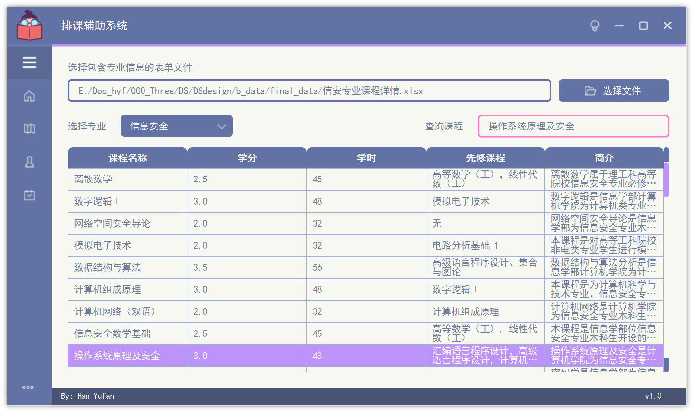

# 数据结构课设

## 个人声明

新手，第一次发项目

仅仅为了存储自己学习的一些项目，若能帮到大家那真是太好啦

界面配色参考https://github.com/Wanderson-Magalhaes/Modern_GUI_PyDracula_PySide6_or_PyQt6

page3交互界面参考https://csacademy.com/app/graph_editor/

## 问题描述

制作某计算机学院专业课及专业选修课的课程计划辅助编排系统。

## 开发环境

  编程语言：Python3.7 
  
  IDE：PyCharm

  图形界面开发工具：PySide6、QtDesigner

## 数据来源

  北工大信息学部官网的课程简介和培养方案
  
## 最终展示

